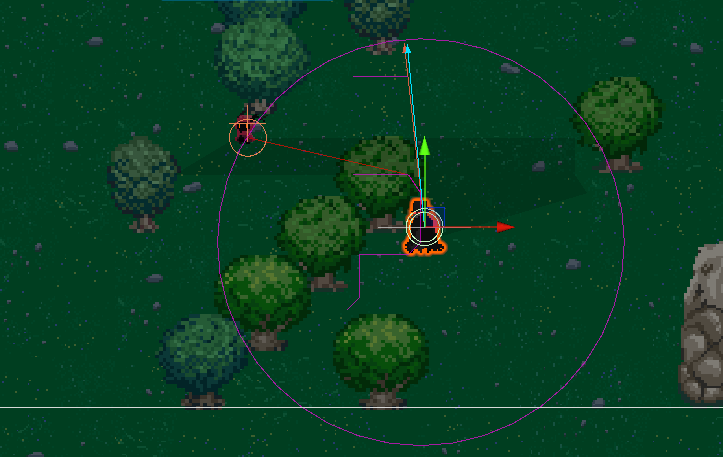

# Game Basic Information #

## Summary ##

Rogue Hollow takes place in a grim fantasy world where the player, a mysterious warrior who has been exiled from their homeland, must purge their world of all evil in hopes that they may one day be able to return to the land they love or die trying. As the player slays enemies, they are granted divine blessings that unlock hidden powers, make them stronger, and improve their chances of survival. However, as the player purges the world of unclean beings, the forces of evil also begin to take notice, sending greater and more powerful enemies to stop this courageous champion.

## Project Resources

[Web-playable version of your game.](https://itch.io/)  
[Trailor](https://youtube.com)  
[Press Kit](https://dopresskit.com/)  
[Proposal: make your own copy of the linked doc.](https://docs.google.com/document/d/1qwWCpMwKJGOLQ-rRJt8G8zisCa2XHFhv6zSWars0eWM/edit?usp=sharing)  

## Gameplay Explanation ##

- The basic movement of the game is `wasd` or the `arrow keys` where `a` or `left arrow` would move the player left.
- Combat system for the player's attack is `automatic` with a time delay.
- Navigate across the terrian as you avoid the incoming enemies while trying to slay them to gain experience points.
- Experience points allow user to level up and get stronger with new abilities the higher level you are.
- Enemies spawn around you and moves toward the player in an attempt to attack you.
  - Every minute a boss monster spawns that has tons more health and does more damage with unique attack skill
- Timer system to keep track of total survival time as you aim to be the longest survived.

**Add it here if you did work that should be factored into your grade but does not fit easily into the proscribed roles! Please include links to resources and descriptions of game-related material that does not fit into roles here.**

# Main Roles #

*Short Description* - Long description of your work item that includes how it is relevant to topics discussed in class. [link to evidence in your repository](https://github.com/dr-jam/ECS189L/edit/project-description/ProjectDocumentTemplate.md)

Here is an example:  
*Procedural Terrain* - The game's background consists of procedurally generated terrain produced with Perlin noise. The game can modify this terrain at run-time via a call to its script methods. The intent is to allow the player to modify the terrain. This system is based on the component design pattern and the procedural content generation portions of the course. [The PCG terrain generation script](https://github.com/dr-jam/CameraControlExercise/blob/513b927e87fc686fe627bf7d4ff6ff841cf34e9f/Obscura/Assets/Scripts/TerrainGenerator.cs#L6).

You should replay any **bold text** with your relevant information. Liberally use the template when necessary and appropriate.

## Producer - Jacky Liu

Organized a team of skilled programmers in an attempt to create a fun and playable game. Roles were assigned based on preferences for the most part. Game concept was discussed and ideas collected from everyone before coming to a consensus of the game we wanted to create. With a 5 week deadline to create a game, we needed an organized timeline and weekly check-ins to keep track of the progress and meet the deadline.
- Week 1:
  - Two meetings where the first was an introduction with the team and discussion of game concept. Second meeting was for writing up the [inital plan](https://docs.google.com/document/d/1lrni1k-Eq6woD4tsD7fNe8eLkTi1OK9iI9SIc25sxOk/edit) and planning for the other weeks task.
- Week 2:
  - Basic organization of the game with player object and movement created to allow other team members to utilize it for implementation of their own tasks.
  - Tested implementation of the ADSR movement feature but didn't feel right for the game.
- Week 3:
  - Meeting to discuss current progress and whether we're on track for the deadline. Determining which features to focus on.
  - Organized the first progress report between the two groups and facilitated conversation
- Week 4:
  - Implementation of a timer system and UI for the timer.
  - Used timer to increase difficulty of enemies and provide passive regen for player.
  - Organized the second progress report between the two groups and facilitated conversation
- Week 5:
  - Two meetings where the team got together to put together an almost finised version of the game and fix any merging problems.
  - Discuss any balancing issues that needed to be implemented for the game to feel better when playing

- Setting up a discord server where communication between the team can be easy and effective.
  - Having different channels that correspond to different components of the project like an assests channel.
- Setting up the github page as an effective way for the team to push and pull changes done by other team memebers.
  - Usage of branches to provide a more organized structure and allow for changes to be made without altering the master branch (but a pain to remerge)
- Usage of [whentomeet](https://www.when2meet.com/?24178901-VsgTi) to organize weekly check-in meetings with the group.
  - Some meetings were held online as it was to get the groups collective input regarding the progress and steps needed to take moving forward.
  - Held three in-person meetings where we took the current progress of all team members and tried compiling it into one game and fixing any bugs that arose.
- Assisted in creation of the player object as well as implementation of the movement system accompanying the sprite animation changes.

## User Interface and Input

**Main Meue and Death Scene**

The main menu contains the game title, the start button, and the quit button. All the buttons have a hover effect that deepens the color when the player hovers over them. When the start button is pressed, the [`main menu script`](https://github.com/Accretionz/Hollow-Survivor/blob/a8d086d04ea9ef618c50da82091e742d89d77bf8/Hollow/Assets/Scripts/MainMenu.cs) allows the player to jump to the game scene to start playing. When the quit button is pressed, the game will stop the quit.

When the player has zero health, the death scene will loaded. The death scene contains the restart button to let the player back to the game and the quit button to quit the game.

**Player Health Bar**

The player health bar displays player health in the upper left corner. The [`health controller`](https://github.com/Accretionz/Hollow-Survivor/blob/a8d086d04ea9ef618c50da82091e742d89d77bf8/Hollow/Assets/Scripts/PlayerHealthController.cs) script is designed to define the initial health, max health, and functions that can implement the health changes throughout the game. Based on current health, the bar would display the correct number of full, half, and empty hearts. Half of a heart will be gone when an enemy or a projectile damages the player.

**Player Experience Bar**

The experience bar displays the current experience in the top center of the screen. The player can gain experience by killing different types of enemies. A crow is worth 100, a bat is worth 200 and a boss is worth 500. The [`experience controller`](https://github.com/Accretionz/Hollow-Survivor/blob/a8d086d04ea9ef618c50da82091e742d89d77bf8/Hollow/Assets/Scripts/ExperienceController.cs) is designed to keep track of the status of the experience bar. There are a total of 9 statuses for the bar besides empty and full status. The bar will display the correct image based on the ratio of the current experience to the maximum experience. Maximum experience is increasing as the game level goes up. More experience is required to reach the next level.

**Level System**

When the game level goes up, a fading notification says "Level UP!" will show under the experience bar. This is done by the [`fading text`](https://github.com/Accretionz/Hollow-Survivor/blob/a8d086d04ea9ef618c50da82091e742d89d77bf8/Hollow/Assets/Scripts/FadingText.cs) script. A level counter is placed next to the experience bar. As the notification shows, the level counter would increase by 1.

**Resouces Used**  
[Font](https://nimblebeastscollective.itch.io/magosfonts)  
[Panel for main menu and death scene](https://kenney-assets.itch.io/fantasy-ui-borders)  
[Health bar and experience bar UI](https://byandrox.itch.io/crimson-fantasy-gui)  

## Movement/Physics

**Describe the basics of movement and physics in your game. Is it the standard physics model? What did you change or modify? Did you make your movement scripts that do not use the physics system?**

## Animation and Visuals

**List your assets, including their sources and licenses.**

**Player**
[Satyr](https://lucky-loops.itch.io/character-satyr)
**Mobs**
[Melee Crow Mob](https://gabry-corti.itch.io/plague-crow)
[Ranged Bat Mob](https://gabry-corti.itch.io/assassin-bat)
[Boss Mob](https://assetstore.unity.com/packages/2d/characters/bringer-of-death-free-195719)
**Describe how your work intersects with game feel, graphic design, and world-building. Include your visual style guide if one exists.**

## Game Logic - Ryan Tan

**Enemy AI**
This game is all about massive hordes of mobs swarming the player. To accomplish this I decided to use [NavMeshPlus](https://github.com/h8man/NavMeshPlus?tab=readme-ov-file) which is a 2D pathfinding system. Using NavMesh for the enemy AI was very helpful as the map we decided to use had a lot of terrain. Using NavMesh you can designate terrain as nonwalkable and have an easy solution for the enemies to path intelligently towards the player while avoiding terrain.

**Design Pattern**
We did not have a specific design pattern as most of our parts were done individually and then pieced together. The main bulk of the game are in the prefabs. This is how the enemy mobs and player attacks are generated and used in the game. Each prefab has their own designated controller to control their attack patterns and behaviour.
 

# Sub-Roles

## Audio

**List your assets, including their sources and licenses.**

**Describe the implementation of your audio system.**

**Document the sound style.** 

## Gameplay Testing

**Add a link to the full results of your gameplay tests.**

**Summarize the key findings from your gameplay tests.**

## Narrative Design - Ryan Tan

**Document how the narrative is present in the game via assets, gameplay systems, and gameplay.** 
Our game was inspired by *Vampire Survivor* and *Hollow Knight*. We tried picking assets that had the same dark fantasy theme as *Hollow Knight*. To be honest there isn't much of a narrative we are trying to push except surviving through waves of mob to level up and get stronger and kill even more mobs. 

## Press Kit and Trailer

**Include links to your presskit materials and trailer.**

**Describe how you showcased your work. How did you choose what to show in the trailer? Why did you choose your screenshots?**

## Game Feel and Polish - Jacky Liu

**Document what you added to and how you tweaked your game to improve its game feel.**
- Added a UI for the timer and coded the implementation of the [timer system](https://github.com/Accretionz/Hollow-Survivor/blob/1b1df3d0df6cc7b45ec2193a53eaad45bcbde39a/Hollow/Assets/Scripts/Timer.cs#L24) that connects with the UI.
  - Used the timer system as a way to increase difficulty of the enemies where they deal [increased damage](https://github.com/Accretionz/Hollow-Survivor/blob/1b1df3d0df6cc7b45ec2193a53eaad45bcbde39a/Hollow/Assets/Scripts/PlayerController.cs#L105)
  - Also added [passive regeneration](https://github.com/Accretionz/Hollow-Survivor/blob/1b1df3d0df6cc7b45ec2193a53eaad45bcbde39a/Hollow/Assets/Scripts/PlayerController.cs#L93) that occurs every 15 seconds
  - Attempted implementation of a leaderboard where it keeps track of the highest scores and stores the data using json files. However it doesn't display the scores on the leaderboard UI screen correctly.
  - 
 
- Spent the final few days making balance changes for the game.
  - Altering the movement speed of the player and enemies to make it feel balanced but still provide challenge.
  - Increased enemies health to make it harder to kill, increasing difficulty
  - Removed the healing to full health every level up due to it being too broken and caused a visual bug

